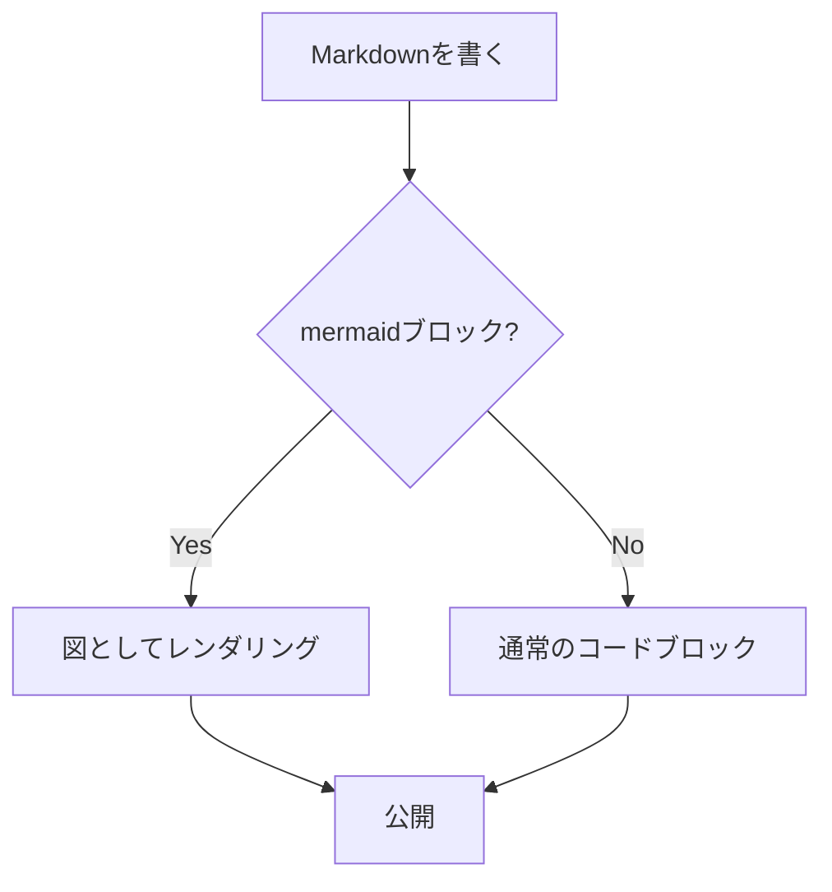
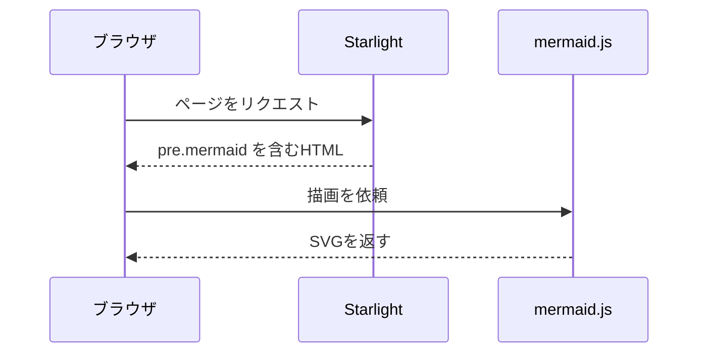
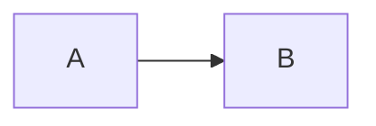

Markdown中の ` ```mermaid ` コードブロックは、`astro-mermaid` によって図としてレンダリングされる。
描画はブラウザ側で行われ、テーマはサイトのライト/ダーク切り替えに追従する。

## フローチャート


```mermaid
graph TD
    A[Markdownを書く] --> B{mermaidブロック?}
    B -->|Yes| C[図としてレンダリング]
    B -->|No| D[通常のコードブロック]
    C --> E[公開]
    D --> E
```

## シーケンス図


```mermaid
sequenceDiagram
    participant B as ブラウザ
    participant S as Starlight
    participant M as mermaid.js

    B->>S: ページをリクエスト
    S-->>B: pre.mermaid を含むHTML
    B->>M: 描画を依頼
    M-->>B: SVGを返す
```

## 書き方

````markdown

```mermaid
graph LR
    A --> B
```
````
